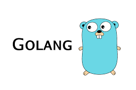

# Training Golang 

This repo aim to store the code I will make during my learning journey.

# Table of content

1. Discovering
    - [Hello world](https://github.com/slashformotion/TrainingGolang/tree/master/helloworld)
    - [Variables](https://github.com/slashformotion/TrainingGolang/tree/master/variables)
    - [Conditions](https://github.com/slashformotion/TrainingGolang/tree/master/conditions)
    - [Iteration](https://github.com/slashformotion/TrainingGolang/tree/master/iteration)
    - [Range](https://github.com/slashformotion/TrainingGolang/tree/master/range)
    - [Arrays](https://github.com/slashformotion/TrainingGolang/tree/master/arrays)
    - [Slices (dynamics arrays)](https://github.com/slashformotion/TrainingGolang/tree/master/slices)
    - [Type convertion (cast)](https://github.com/slashformotion/TrainingGolang/tree/master/convertion)
    - [Errors](https://github.com/slashformotion/TrainingGolang/tree/master/errors)
    - [Defer *(This is amazing)*](https://github.com/slashformotion/TrainingGolang/tree/master/defer)
    - [Pointers](https://github.com/slashformotion/TrainingGolang/tree/master/pointer)
    - [Fonctions](https://github.com/slashformotion/TrainingGolang/tree/master/fonctions)
    - [Visibilité](https://github.com/slashformotion/TrainingGolang/tree/master/visibilite)

2. Typing
    - [Struct](https://github.com/slashformotion/TrainingGolang/tree/master/TYPING/struct)
    - [Receivers](https://github.com/slashformotion/TrainingGolang/tree/master/TYPING/receivers) 
    - [Pointer Receiver](https://github.com/slashformotion/TrainingGolang/tree/master/TYPING/structPointerReceiver) *(Make operation on struct easier)*
    - [Embedded Struct](https://github.com/slashformotion/TrainingGolang/tree/master/TYPING/embeddedStruct)

3. Projects
    - [Find and Replace Strings in txt files](https://github.com/slashformotion/TrainingGolang/tree/master/PROJECTS/findReplaceStr)

